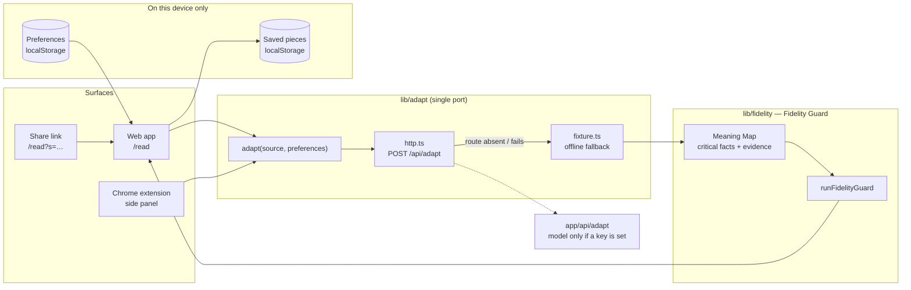
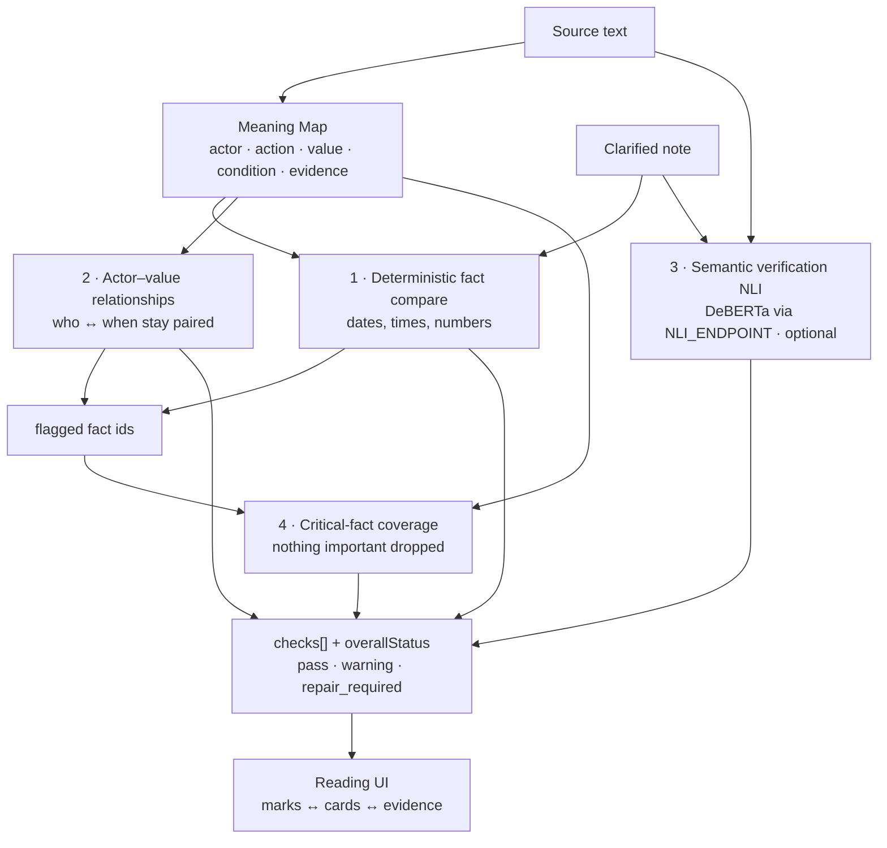

# Linaw AI

**Clarify the format. Preserve the meaning.**

Linaw takes one message — a notice, an email, a lesson — and gives it back to each reader in the format they chose (key points or full detail, plain or original wording, read or listened to), then runs a **Meaning Check** that compares every critical fact in the adapted note against the source before the reader relies on it.

## Status — what is live and what is not

Kept literally accurate; update it when the code changes.

| Part | State tonight |
| --- | --- |
| Reading workspace, preferences (detail · wording incl. **Taglish** · delivery), three note layouts (text · at a glance · one at a time), Listen with word tracking, PDF/text intake, saved pieces on device, share links (`/read?s=…`) | **Live** in the browser |
| Meaning Check layers 1, 2, 4 — deterministic fact compare, actor–value relationships, critical-fact coverage (`lib/fidelity/`) | **Live** rule-based logic; tested in `evals/` |
| Meaning Check layer 3 — semantic verification (NLI) | **Live when the local verifier is running.** `/api/adapt` calls `lib/fidelity/nli.ts`, which posts to the DeBERTa service in `nli-service/` (`cross-encoder/nli-deberta-v3-base`) via `NLI_ENDPOINT`. When the service is down or the env var is unset, the layer reports *Not run* and is excluded from the verdict |
| The adaptation itself (`adapt()` in `lib/adapt/`) | **Client port posts to `/api/adapt`.** With no model key, the route runs the offline sample adapter (`fixture.ts`), and the browser falls back to that fixture if the route fails. The fixture adapts the campus-pilot example (original, plain, or Taglish) and its seeded failure case. For other input, the UI says the note was not produced from that text |
| Live model path (Gemini inside `/api/adapt`) | **Wired, off unless a key is set.** `app/api/adapt/model.ts` runs only when `GEMINI_API_KEY` or the gateway env is present. The seeded failure example never uses the model. The reading screen says when text will be sent. See `SECURITY.md` and `.env.example`. Do not commit a key |
| Chrome extension (`extension/`) | Builds (`node extension/build.mjs`); MV3 side panel + content script calling the same `adapt()` port. Load unpacked from `extension/` |

Run: `npm install && npm run dev` → http://localhost:3000. Check: `npm run typecheck && npm test`. CI runs both plus `next build` on every push.

## Architecture

Full write-up — surfaces, the single port, model provider order (Gemini → OpenAI-compatible gateway → fixture), the Fidelity Guard layers, storage, environment, and known limits: [`docs/architecture.md`](docs/architecture.md).

One Next.js app. Every surface calls the same `adapt()` port; the port decides where adaptation happens (today: try `/api/adapt`, fall back to the in-browser fixture).

### Meaning Check pipeline

Layers stay separate and are reported separately — never collapsed into one score. A layer that did not run says so.

Verdict language is deliberately cautious ("No issue found in these checks.", "The time appears to be attached to the wrong group.") — it never claims a guarantee.

### Repository map

| Path | What lives there |
| --- | --- |
| `app/` | Next.js routes: landing, onboarding, `/read`, `/content`, `/settings` |
| `components/read/` | Reading workspace, Meaning Check rail, Listen, share links, toasts |
| `components/sindi/` | Ray, the mascot — presentational, driven by a `state` prop |
| `lib/domain/` | Zod schemas: preferences, meaning map, checks, adapt request/response |
| `lib/adapt/` | The single `adapt()` port and its implementations |
| `lib/fidelity/` | Fidelity Guard layers and the pipeline entry |
| `evals/` | Golden campus-pilot case, seeded corruption, fidelity cases (vitest) |
| `nli-service/` | Local FastAPI DeBERTa NLI verifier + evaluation scripts |
| `extension/` | Manifest V3 Chrome companion |
| `spec/` | Phase specs — the build contract; `docs/` — canon, agent rules, AppCon research |

Privacy and data handling: [`SECURITY.md`](SECURITY.md).

Human guide (what Linaw is, how to run, specs, extension, `/todo`):

[`docs/README.md`](docs/README.md)

Agent guide: [`docs/AGENTS.md`](docs/AGENTS.md)

Product canon: [`docs/LINAW_AI_INITIAL-DRAFT_PROJECT_CONTEXT.md`](docs/LINAW_AI_INITIAL-DRAFT_PROJECT_CONTEXT.md)
