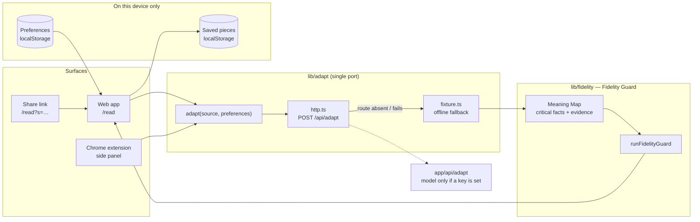
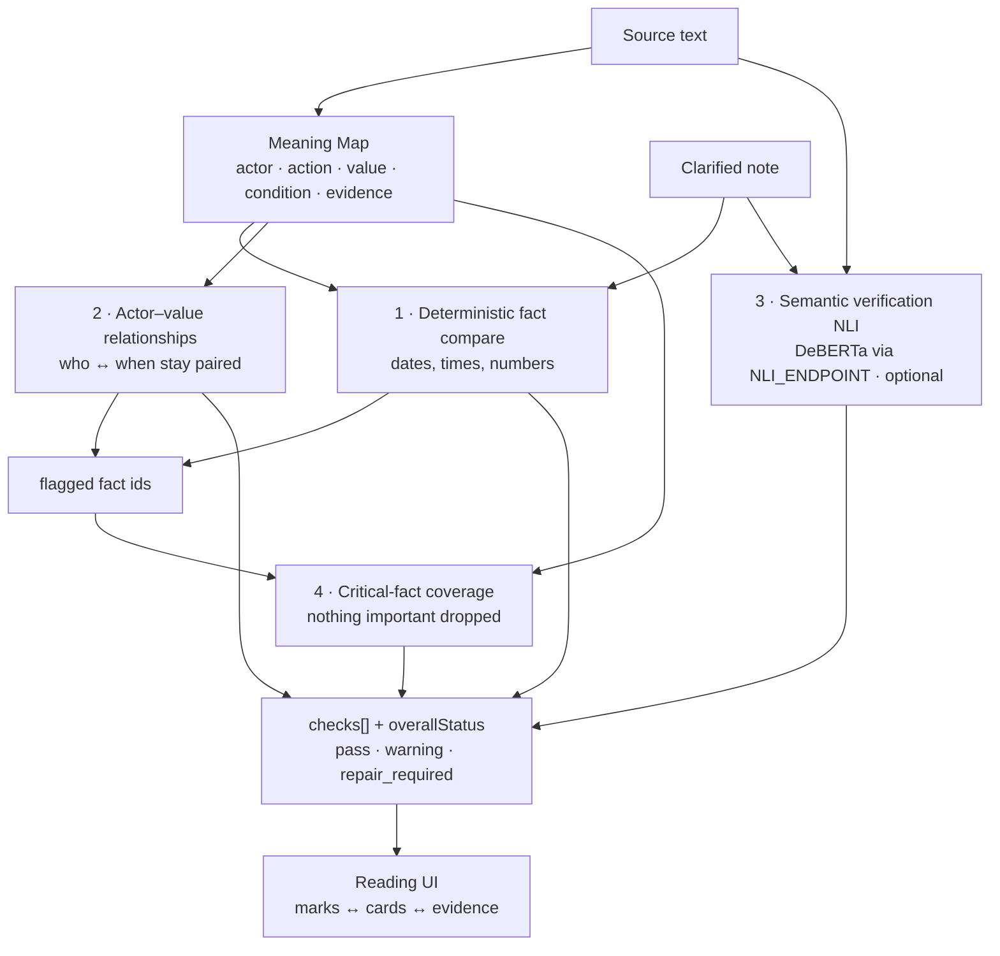

# Linaw AI

<p align="center">
  
</p>

<h3 align="center">Clarify the format. Preserve the meaning.</h3>

<p align="center">
  Linaw AI adapts important information to how each person prefers to receive it, then checks whether the critical meaning survived.
</p>

<p align="center">
  <a href="#live-demo">Live demo</a> ·
  <a href="docs/architecture.md">Architecture</a> ·
  <a href="SECURITY.md">Security and privacy</a> ·
  <a href="LICENSE">MIT License</a>
</p>

> **Demo status:** The repository runs locally without an API key through its offline fixture. Add the deployed Vercel URL to the [Live demo](#live-demo) section before submission.

## Product overview

Important notices, lessons, policies, and instructions are usually written in one fixed format. People may instead need key points, plain language, full detail, or audio. Generic summarization can make a message easier to read while dropping a deadline, condition, exception, number, or responsibility.

Linaw AI addresses that risk with a personalized reading layer and a **Meaning Check**. The original source remains authoritative; Linaw adapts the presentation and checks critical facts against the source before the reader relies on the result.

### What users can do

- Choose **Full Detail** or **Key Points**.
- Choose **Original Wording** or **Plain Language**, including Taglish where supported.
- Read the result in text, at-a-glance, one-at-a-time, or Listen mode.
- Inspect critical facts, evidence, and warnings in the Meaning Check.
- Save pieces on the device, create share links, and use the Chrome companion.

### Why it matters

Linaw is not a generic chatbot, summarizer, or diagnostic tool. It is an **adaptive information communication system** for institutions and the people they serve. The initial beachhead is schools, universities, and organizations that send deadline-heavy information to students and members. The business model is B2B2C: institutions are the paying customers, while students, employees, members, and citizens are the end users.

## Product preview

The repository currently includes the Linaw app icon at [`public/linaw-logo-transparent.png`](public/linaw-logo-transparent.png). Add the supplied transparent logo and sunray artwork to `public/` when available, using these names:

```text
public/linaw-logo-transparent.png
public/sunray.png
```

The landing page is designed to use those assets as the brand mark and background sunray. Keeping the image files in `public/` lets Next.js serve them at `/linaw-logo-transparent.png` and `/sunray.png`.

### Demo media placeholders

Keep the README visually clean by showing one strong product screenshot and linking the video and deployment separately:

| Resource           | Replace with                                                 | Recommended presentation                                           |
| ------------------ | ------------------------------------------------------------ | ------------------------------------------------------------------ |
| Product screenshot | `docs/media/linaw-reading-workspace.png`                     | Show the source, adapted note, and Meaning Check together          |
| Video demo         | `docs/media/linaw-demo.mp4` or an unlisted YouTube/Loom link | Use a linked thumbnail rather than embedding a large player        |
| Live demo          | The deployed Vercel URL                                      | Use one text link in the header and one button in the presentation |

Add the screenshot only after capturing the final UI. For a five-minute pitch, the screenshot is the cleanest README visual; the video is best linked for reviewers who want to inspect the workflow.

<!-- Optional after the files exist:

[Watch the 60-second demo](docs/media/linaw-demo.mp4)
-->

### Live demo

**Vercel URL:** `https://appcon-lumiere-linawai.vercel.app/`

The live deployment should open the landing page and provide the working reading flow. Keep the video as a separate link so the README stays quick to scan.

## Run locally

### Requirements

- Node.js 20 or newer
- npm
- Python 3.11 or newer only if enabling the optional NLI verifier

### Web application

```bash
npm install
npm run dev
```

Open [http://localhost:3000](http://localhost:3000).

The app works without a model key by using the campus-pilot offline fixture. To enable live model adaptation, copy `.env.example` to `.env.local` and configure one of the documented providers. Never commit `.env.local` or API keys.

### Optional semantic verifier

The NLI layer is optional and runs locally through the FastAPI service:

```bash
cd nli-service
python -m venv .venv
# Windows PowerShell
.venv\Scripts\Activate.ps1
pip install -r requirements.txt
uvicorn app:app --host 127.0.0.1 --port 8001
```

Then set `NLI_ENDPOINT=http://127.0.0.1:8001/predict` for server-side checks and `NEXT_PUBLIC_NLI_ENDPOINT=http://127.0.0.1:8001/predict` for the browser reading path. When it is unavailable, Linaw reports that layer as **Not run** rather than pretending it checked the claim.

### Chrome extension

```bash
npm run build
```

In Chrome, open `chrome://extensions`, enable Developer mode, choose **Load unpacked**, and select the generated `extension/` directory. The extension expects the Linaw app at `127.0.0.1:3000` or `localhost:3000`.

## Validation

```bash
npm run typecheck
npm test
npm run build
```

The test suite covers the campus-pilot flow, fidelity cases, policy cases, and seeded meaning-preservation failures.

## Architecture

Full write-up — surfaces, the single port, model provider order (Gemini → OpenAI-compatible gateway → fixture), the Fidelity Guard layers, storage, environment, and known limits: [`docs/architecture.md`](docs/architecture.md).

One Next.js app. Every surface calls the same `adapt()` port; the port decides where adaptation happens (today: try `/api/adapt`, fall back to the in-browser fixture).



### Meaning Check pipeline

Layers stay separate and are reported separately — never collapsed into one score. A layer that did not run says so.



Verdict language is deliberately cautious ("No issue found in these checks.", "The time appears to be attached to the wrong group.") — it never claims a guarantee.

### Repository map

| Path                | What lives there                                                      |
| ------------------- | --------------------------------------------------------------------- |
| `app/`              | Next.js routes: landing, onboarding, `/read`, `/content`, `/settings` |
| `components/read/`  | Reading workspace, Meaning Check rail, Listen, share links, toasts    |
| `components/sindi/` | Ray, the mascot — presentational, driven by a `state` prop            |
| `lib/domain/`       | Zod schemas: preferences, meaning map, checks, adapt request/response |
| `lib/adapt/`        | The single `adapt()` port and its implementations                     |
| `lib/fidelity/`     | Fidelity Guard layers and the pipeline entry                          |
| `evals/`            | Golden campus-pilot case, seeded corruption, fidelity cases (vitest)  |
| `nli-service/`      | Local FastAPI DeBERTa NLI verifier + evaluation scripts               |
| `extension/`        | Manifest V3 Chrome companion                                          |
| `spec/`             | Phase specifications and acceptance contracts                         |

Privacy and data handling: [`SECURITY.md`](SECURITY.md). The only server route is `POST /api/adapt`; source text is not written to disk by Linaw. If a model provider is configured, source text is sent to that provider, so review its retention policy before using personal data.

## AI implementation

The adaptation path is deliberately provider-agnostic:

1. **Gemini** is tried when `GEMINI_API_KEY` is configured.
2. An **OpenAI-compatible gateway** is tried when `LLM_API_BASE` and `LLM_API_KEY` are configured.
3. The **offline fixture** keeps the prototype usable when no model is configured or a provider fails.

Every model response is expected to return adapted text plus a structured Meaning Map with verbatim evidence. Unsupported or ungrounded facts are dropped before the Meaning Check runs. Provider keys remain server-side.

## Ownership and intellectual property

Linaw AI is open source under the MIT License. The participating team retains ownership of its original code, designs, concepts, and innovations. Third-party dependencies remain under their respective licenses; see `package.json` and the relevant upstream projects for dependency details.

Proprietary services, when configured, are optional integrations rather than requirements for the core prototype. The public repository remains runnable with the offline fixture, and `.env.example` documents how to substitute or connect a provider.

See [`LICENSE`](LICENSE) for the full license terms.

Human guide (what Linaw is, how to run, specs, extension, `/todo`):

[`docs/README.md`](docs/README.md)

Agent guide: [`docs/AGENTS.md`](docs/AGENTS.md)

Product canon: [`docs/LINAW_AI_INITIAL-DRAFT_PROJECT_CONTEXT.md`](docs/LINAW_AI_INITIAL-DRAFT_PROJECT_CONTEXT.md)
