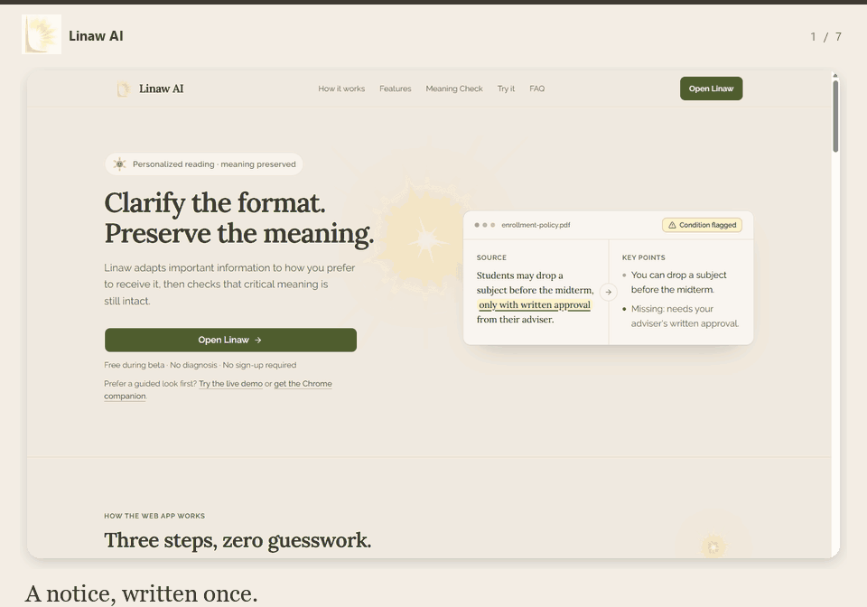
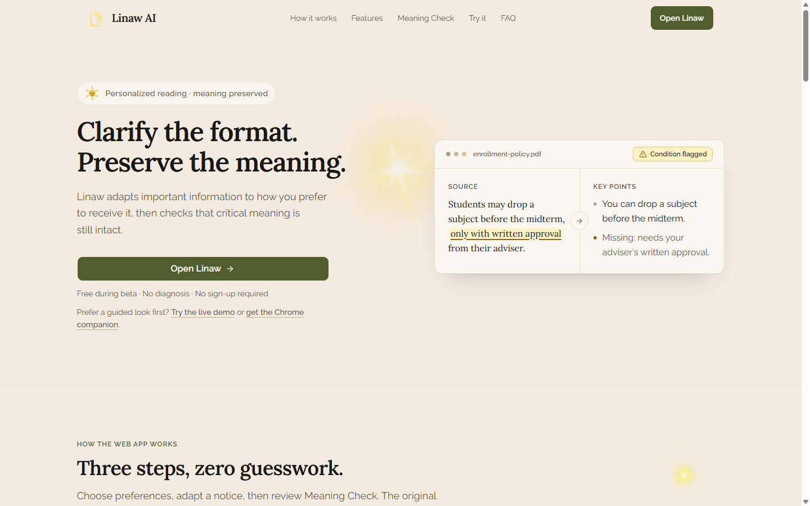
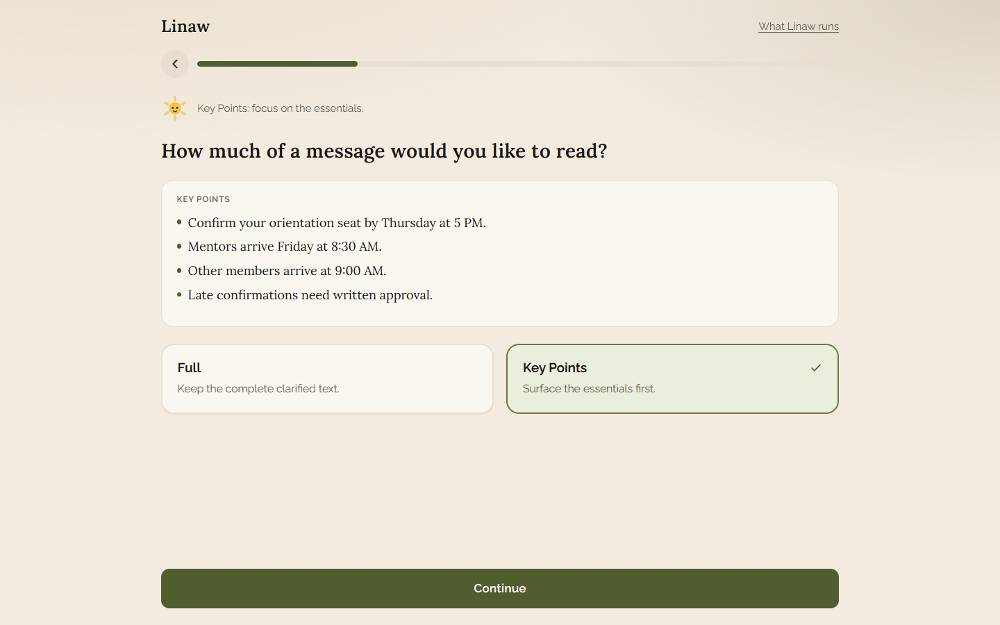
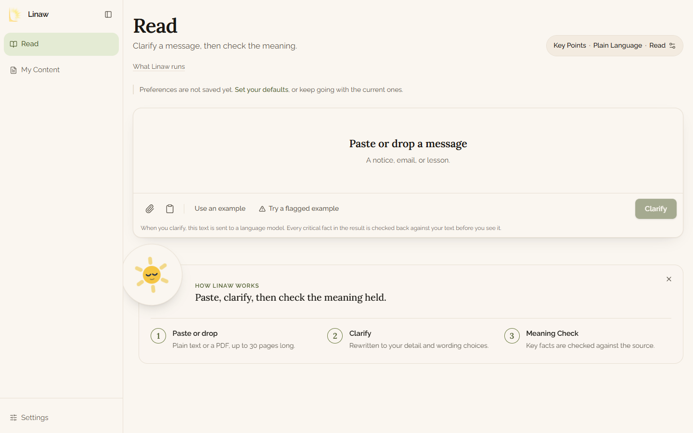
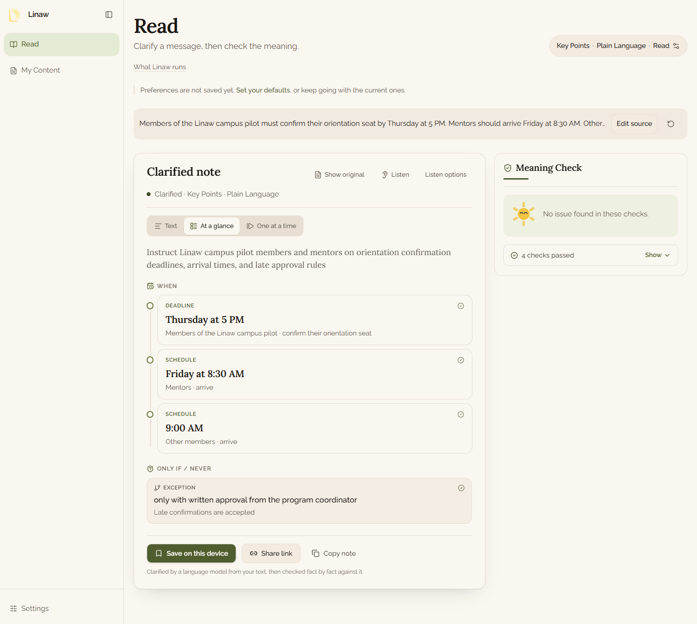
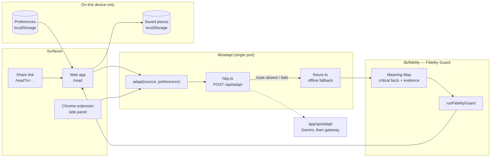
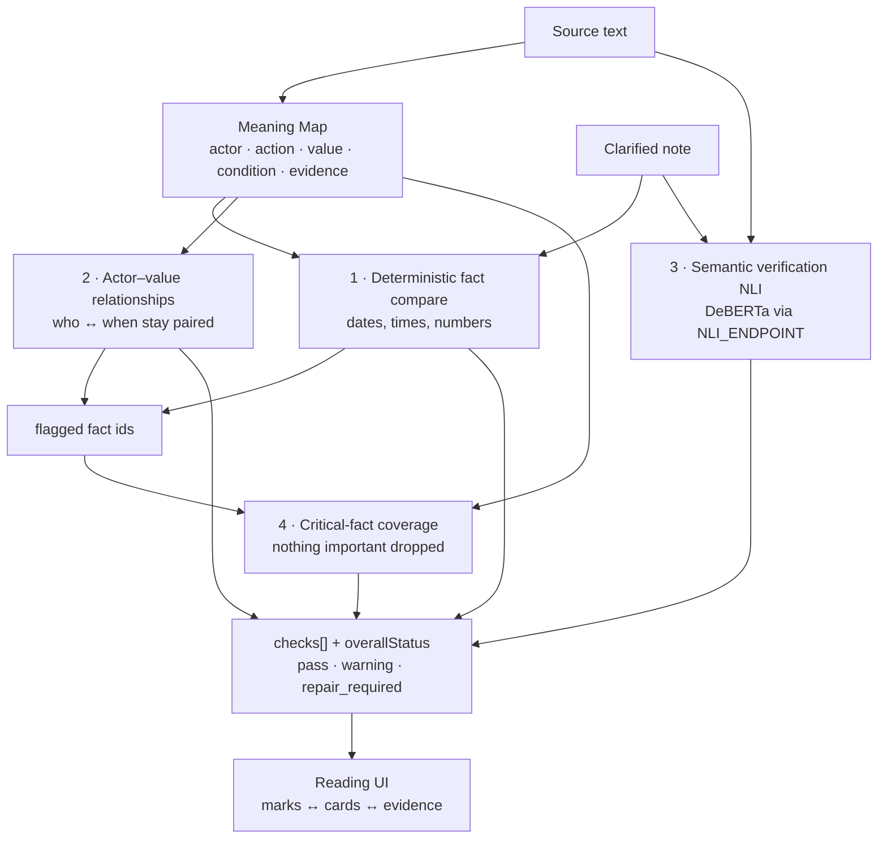

# LINAW

Layered Intelligence for Narrative Adaptation & Watching


### Clarify the format. Preserve the meaning.

Linaw is a browser extension (with a companion web app) that sits on top of content people already have open — a Google Classroom module, a school announcement, a memo, a PDF — and lets each reader choose how they receive it: Full, Key Points, Plain Language, or Listen. Every adapted version is then checked against the original for meaning drift — specifically the details most likely to break silently: dates, conditions, exceptions, and who-does-what-when. If something looks lost or changed, Linaw warns the reader instead of silently presenting an incomplete version as complete.

Adaptive Information Communication System: one notice, rewritten into the format each reader absorbs, then cross-examined. Gemini generation, Meaning Maps, fact alignment, actor-value binding, and DeBERTa NLI keep the intended meaning intact.

[Live app](#live-app) · [Architecture](docs/architecture.md) · [Security and privacy](SECURITY.md) · [MIT License](LICENSE)

## Product overview

### What users can do

- Choose **Full Detail** or **Key Points**.
- Choose **Original**, **Plain Language**, or **Taglish**.
- Read the result in text, at-a-glance, one-at-a-time, or Listen mode.
- Inspect critical facts, evidence, and warnings in the Meaning Check.
- Save pieces on the device, create share links, and use the Chrome companion.

### Why it matters

Linaw is not a generic chatbot, summarizer, or diagnostic tool. It is an **adaptive information communication system** for institutions and the people they serve. The initial beachhead is schools, universities, and organizations that send deadline-heavy information to students and members. The business model is B2B2C: institutions are the paying customers, while students, employees, members, and citizens are the end users.

## Live app

[https://appcon-lumiere-linawai.vercel.app/](https://appcon-lumiere-linawai.vercel.app/)

The hosted app clarifies with Gemini. If Gemini does not return a note, it uses the OpenAI-compatible gateway. Meaning Check sends the source sentence and the claim to `https://linaw-nli.onrender.com/predict`.

## Screens

Phone, tablet, and desktop frames of each screen are in [docs/screenshots](docs/screenshots). The companion panel is not in these frames.











## Run locally

### Requirements

- Node.js 20 or newer
- npm
- Python 3.11 or newer only for a local copy of the semantic check

### Web application

```bash
npm install
npm run dev
```

Open [http://localhost:3000](http://localhost:3000).

A local run without a model key uses the offline sample for the campus notice, and says when a note was not produced from other text. Copy `.env.example` to `.env.local` to call Gemini or the gateway. Never commit `.env.local` or API keys.

### Semantic check

The hosted app sets `NLI_ENDPOINT` to `https://linaw-nli.onrender.com/predict`. A local run can use the same service from this repository:

```bash
cd nli-service
python -m venv .venv
# Windows PowerShell
.venv\Scripts\Activate.ps1
pip install -r requirements.txt
uvicorn app:app --host 127.0.0.1 --port 8001
```

Then set `NLI_ENDPOINT=http://127.0.0.1:8001/predict`. When the endpoint is unset, or the call does not answer within 4 seconds, that layer stays out of the verdict and the screen says the semantic check did not run.

### Chrome extension

```bash
npm run build
```

In Chrome, open `chrome://extensions`, enable Developer mode, choose **Load unpacked**, and select `extension/`. The extension asks `https://appcon-lumiere-linawai.vercel.app`, then `http://127.0.0.1:3000`, then `http://localhost:3000`.

## Validation

```bash
npm run typecheck
npm test
npm run build
```

The test suite covers the campus-pilot flow, fidelity cases, policy cases, and seeded meaning-preservation failures.

## Architecture

Full write-up — surfaces, the single port, model provider order (Gemini → OpenAI-compatible gateway → fixture), the Fidelity Guard layers, storage, environment, and known limits: [docs/architecture.md](docs/architecture.md).

One Next.js app. Every surface calls the same `adapt()` port. The port posts to `/api/adapt`, and uses the in-browser sample if that route fails.




### Meaning Check pipeline

Layers stay separate and are reported separately — never collapsed into one score. A layer that did not run says so.




Verdict language is deliberately cautious ("No issue found in these checks.", "The time appears to be attached to the wrong group.") — it never claims a guarantee.

### Repository map


| Path                | What lives there                                                      |
| ------------------- | --------------------------------------------------------------------- |
| `app/`              | Next.js routes: landing, onboarding, `/read`, `/content`, `/settings` |
| `components/read/`  | Reading workspace, Meaning Check rail, Listen, share links, toasts    |
| `components/sindi/` | Ray, the mascot — presentational, driven by a `state` prop            |
| `lib/domain/`       | Zod schemas: preferences, meaning map, checks, adapt request/response |
| `lib/adapt/`        | The single `adapt()` port and its implementations                     |
| `lib/fidelity/`     | Fidelity Guard layers and the pipeline entry                          |
| `evals/`            | Golden campus-pilot case, seeded corruption, fidelity cases (vitest)  |
| `nli-service/`      | Local FastAPI DeBERTa NLI verifier + evaluation scripts               |
| `extension/`        | Manifest V3 Chrome companion                                          |
| `spec/`             | Phase specifications and acceptance contracts                         |


Privacy and data handling: [SECURITY.md](SECURITY.md). The only server route is `POST /api/adapt`; source text is not written to disk by Linaw. If a model provider is configured, source text is sent to that provider, so review its retention policy before using personal data.

## AI implementation

The adaptation path is deliberately provider-agnostic:

1. **Gemini** runs when `GEMINI_API_KEY` or `GOOGLE_GENERATIVE_AI_API_KEY` is set. The hosted app uses this first.
2. An **OpenAI-compatible gateway** runs when `LLM_API_BASE` and `LLM_API_KEY` are set, and Gemini does not return a note.
3. The **offline sample** runs when no model is configured, when every provider fails, and for the warning notice.

Every model response is expected to return adapted text plus a structured Meaning Map with verbatim evidence. Unsupported or ungrounded facts are dropped before the Meaning Check runs. Provider keys remain server-side.

## Ownership and intellectual property 

Linaw AI is licensed under the MIT License. See [LICENSE](LICENSE).

The license covers the software in this repository. It does not cover messages, files, or preferences a reader supplies. OTis Philippines Inc., organizer of AppCon 2026, may use that source code for marketing and sponsors. That use covers source code only. Packages in `node_modules` and the DeBERTa checkpoint stay under their own licenses.

A local run without a model key still uses the offline sample. `.env.example` documents Gemini, the gateway, the semantic check, and the optional cloud account.

Human guide (what Linaw is, how to run, specs, extension, What Linaw runs at `/todo`):

[docs/README.md](docs/README.md)

Agent guide: [docs/AGENTS.md](docs/AGENTS.md)

Product canon: [docs/LINAW_AI_INITIAL-DRAFT_PROJECT_CONTEXT.md](docs/LINAW_AI_INITIAL-DRAFT_PROJECT_CONTEXT.md)
