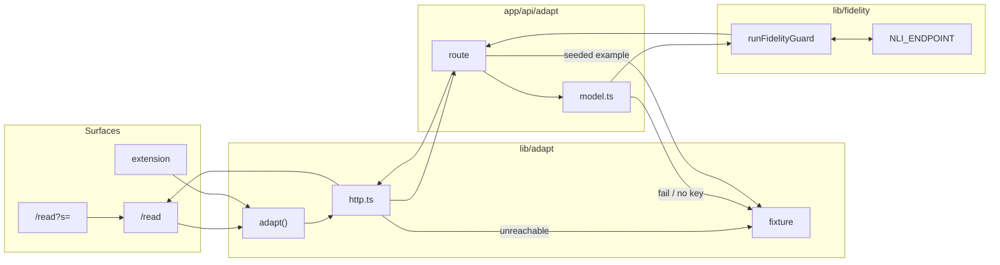
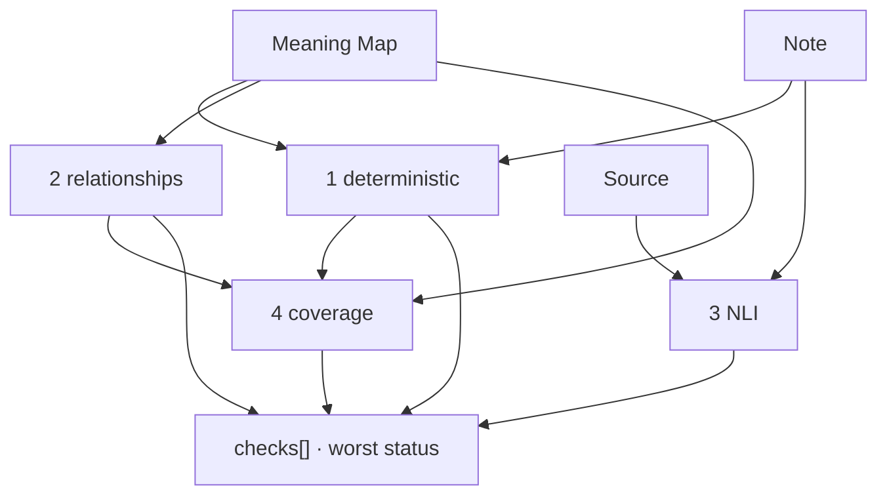

# Linaw AI — Architecture

Single Next.js app. One `package.json`. The only server route is `POST /api/adapt`.
UI imports `adapt()` from `lib/adapt` only. Product canon:
[`LINAW_AI_INITIAL-DRAFT_PROJECT_CONTEXT.md`](LINAW_AI_INITIAL-DRAFT_PROJECT_CONTEXT.md).
Data handling: [`../SECURITY.md`](../SECURITY.md).

## Stack

Versions from `package.json` / `nli-service/requirements.txt`. Nothing else is a runtime.

### App

| Piece | Version / notes |
| --- | --- |
| Language | TypeScript 5.9, `strict`, target ES2017 |
| UI runtime | React 19.1, React DOM 19.1 |
| Framework | Next.js 15.5 App Router (`app/`). `next/font/google` (Lora, Raleway). `next/link`, `next/navigation`, `next/dynamic` |
| Node | 22 (CI `actions/setup-node`). `@types/node` 22 |
| CSS | Tailwind CSS 4.1, `@tailwindcss/postcss` 4.1, PostCSS 8.5.28 (override), `tw-animate-css` 1.4 |
| UI kit | shadcn (`components.json` radix-nova): button, input, textarea, dialog, sheet, sidebar, table, toggle, toggle-group, tooltip, separator, skeleton. `radix-ui` 1.6.7, `class-variance-authority` 0.7.1, `clsx` 2.1.1, `tailwind-merge` 3.7.0, `lucide-react` 0.544. `cn` npm package is in `package.json` but unused (`lib/utils.ts` is `clsx` + `tailwind-merge`) |
| Schemas | Zod 4.1 (`lib/domain`, evals, model parse) |
| PDF | `pdfjs-dist` 5.4, worker in the browser, no upload |
| Listen | Web Speech API (`speechSynthesis`) |
| Intake | File drop / `<input type="file">` for `.txt` `.md` `.pdf` |
| Share | `URL`, `btoa`/`atob` base64url |
| Storage | `localStorage`, `sessionStorage`, `chrome.storage.local`. No database, no Redis, no Supabase |
| Auth | none. Optional name/email in `localStorage` |
| HTTP | `fetch` only. No OpenAI SDK, no Gemini SDK, no AI SDK |

### Adapt / models

| Piece | Version / notes |
| --- | --- |
| Route | Next.js Route Handler, Node runtime, `app/api/adapt` — the only API route |
| Gemini | `POST https://generativelanguage.googleapis.com/v1beta/models/{id}:generateContent`, default model `gemini-3.8-flash`, 40 s |
| Gateway | `POST {LLM_API_BASE}/chat/completions`, Bearer key, default model `auto`, 75 s, `chat_template_kwargs.enable_thinking: false` |
| Fixture | in-process TypeScript, `lib/adapt/fixture.ts` |

### Fidelity / NLI (`nli-service/`)

| Piece | Version / notes |
| --- | --- |
| Guard | TypeScript in `lib/fidelity` (deterministic, relationship, NLI slot, coverage) |
| API | FastAPI 0.141.1, uvicorn 0.53 |
| Model runtime | PyTorch 2.14.0 (CPU), Hugging Face Transformers 5.17.0, SentencePiece 0.2.2 |
| Checkpoint | `cross-encoder/nli-deberta-v3-base` from the Hub (base, not fine-tuned) |

### Extension

| Piece | Version / notes |
| --- | --- |
| Chrome | Manifest V3: `sidePanel`, `storage`, `activeTab`, `<all_urls>` host permissions, service worker, content script, side panel |
| Bundle | esbuild 0.28, IIFE, Chrome 120, JSX automatic, alias `@` → repo root |
| Font | vendored `Lexend.woff2` (OFL), `chrome.runtime.getURL` |
| Sync | `window.postMessage` with the web app on localhost |

### Tooling

| Piece | Version / notes |
| --- | --- |
| Test | vitest 4.1, environment `node`. `jsdom` 30 is declared, unused by `vitest.config.ts` |
| Types | `tsc --noEmit`; `@types/react` 19.1, `@types/react-dom` 19.1 |
| CI | GitHub Actions, `ubuntu-latest`, Node 22, `npm ci` → typecheck → test → `next build` (`NEXT_TELEMETRY_DISABLED=1`) |
| Scripts | `dev` `build` (extension then Next) `start` `lint` `test` `test:watch` `typecheck` |
| Host | any Node host for Next.js. No `vercel.json`, no Docker for the app |

## Seams

| Port | Entry | Implementations |
| --- | --- | --- |
| Adapt | `lib/adapt/index.ts` → `http.ts` | `POST /api/adapt`; in-browser `fixture.ts` if the route is unreachable or the body is unusable |
| Guard | `lib/fidelity/pipeline.ts` `runFidelityGuard` | four layers, concatenated; worst status wins |
| Preferences | `lib/storage/preferences.ts` | `localStorage` web; `chrome.storage.local` extension; last-write-wins on `updatedAt` |

`index.ts` is the only selector. Callers never import `fixture.ts`, `http.ts`, or `model.ts`.

## Adapt path

`POST /api/adapt` validates `AdaptRequestSchema`. Seeded failure source always uses the fixture. Otherwise Gemini, then OpenAI-compatible gateway, then fixture. First grounded non-empty `adaptedText` wins.

`GET /api/adapt` → `{ adapter, providers }` for the composer disclosure.

Response: `adaptedText`, `meaningMap`, `checks[]`, `overallStatus`, `adapter: "model" | "fixture"`. Header `x-linaw-adapter: model:gemini | model:openai-compatible | fixture`. `{ error }` → 400 → `AdaptRequestError`. Network / invalid body → client fixture, labelled `adapter: "fixture"`. Source is not logged.

| Order | Provider | Env | Call |
| --- | --- | --- | --- |
| 1 | Gemini | `GEMINI_API_KEY`, `GEMINI_MODEL` (default `gemini-3.8-flash`) | `generateContent`, JSON mime, 40 s |
| 2 | OpenAI-compatible | `LLM_API_BASE`, `LLM_API_KEY`, `LLM_MODEL` (default `auto`) | `POST {base}/chat/completions`, 75 s, `chat_template_kwargs.enable_thinking: false` |
| 3 | Fixture | — | campus-pilot sample; foreign source still returns that sample |

`model.ts` asks for `{ sourceIntent, criticalFacts[], adaptedText }`, brace-matches JSON, coerces unknown fact types to `other`, assigns ids, then **drops any fact whose evidence is not a source substring**. Then `runFidelityGuard`. `VERIFICATION_SYSTEM_PROMPT` is unused.

## Domain

Zod in `lib/domain`. Types inferred from schemas.

- Preferences: `detail` (`full` \| `key_points`), `wording` (`original` \| `plain` \| `taglish`), `delivery` (`read` \| `listen`), `browserBehavior` (`auto_adapt` \| `manual`), optional `updatedAt`.
- Meaning Map: `sourceIntent` + `criticalFacts[]` (`id`, `type`, `actor`, `action`, `value`, `condition`, `exception`, `negated`, `evidence`).
- Check: `claim`, `status` (`pass` \| `warning` \| `repair_required`), `evidence`, `reason`.
- Note layout (text / glance / focus) is a Read-page control (`linaw.read.view`), not a preference.

The map is the hinge: Guard, marks, Glance, and Focus all render from it.

## Fidelity Guard

1. **Deterministic** — times, weekdays, numbers, units, negation, must/may, condition/exception markers, names. Known values come from fact `value` / `condition` / `exception` **and** `evidence`.
2. **Relationships** — actor stays attached to the value (seeded failure: mentors' 8:30 AM on everyone).
3. **NLI** — optional. `POST NLI_ENDPOINT` `{ inputs: [{ text, text_pair }] }`, 4 s. Entailment pass, contradiction warning, neutral pass + inconclusive. Unset or fail → reason `Semantic check not connected.` UI: **Not run**, excluded from the verdict. Service: `nli-service/` (`cross-encoder/nli-deberta-v3-base`, default `:8001/predict`).
4. **Coverage** — only when `detail === "key_points"`. High-priority: condition, deadline, exception, prohibition. Facts already flagged by 1–2 are skipped. `full` emits one passing coverage check.

`evals/` is the golden + seeded + fidelity cases. `npm test` runs them.

## Layout

| Route | Role |
| --- | --- |
| `/` | landing |
| `/onboarding` | four preference questions → `PreferenceStore` |
| `/read` | composer → note (text / glance / focus) → Meaning Check. `?piece=` saved, `?s=` shared |
| `/content` | pieces on device |
| `/settings` | preferences + optional local profile |
| `/home` | redirects to `/content` |
| `/todo` | backlog |
| `extension/` | MV3; same `adapt()`. `POST /api/adapt` is **relative to the host page**, so third-party origins fall through to the fixture |

Share: `/read?s=<base64url>`, ≤ 4,000 source chars. Recipient's own preferences apply. PDF/text parse is client-side (`readSourceFile.ts`). Ungrounded map (no evidence substring in the pasted source) is shown as not produced from that text.

## Storage

No database.

| Key | Where |
| --- | --- |
| `linaw.preferences.v1` | `localStorage` / `chrome.storage.local` |
| `linaw.pieces.v1` | `localStorage`, 20,000 chars/piece |
| `linaw.auth.v1` | `localStorage` (optional name, email) |
| `linaw.read.draft` | `sessionStorage` |
| `linaw.read.view`, `linaw.listen.rate` | `localStorage` |
| `linaw.readingComfort.v1` | extension only |

## Environment

| Var | Effect |
| --- | --- |
| `GEMINI_API_KEY`, `GEMINI_MODEL` | primary provider |
| `LLM_API_BASE`, `LLM_API_KEY`, `LLM_MODEL` | fallback gateway |
| `NLI_ENDPOINT` | Guard layer 3 (Node) |
| `NEXT_PUBLIC_NLI_ENDPOINT` | same, browser fixture path |

`.env.local` only. Keys stay in Node.

## Invariants

- No second adapt path. No other `app/api` routes.
- Layers stay separate; never a single score or “verified”.
- On-screen verb is Clarify. Preference language, never labels.
- Gateway can take ~20–30 s; no `vercel.json` yet — serverless default 10 s will time out.
- Gateway retention is unpublished; do not send personal data through it.
